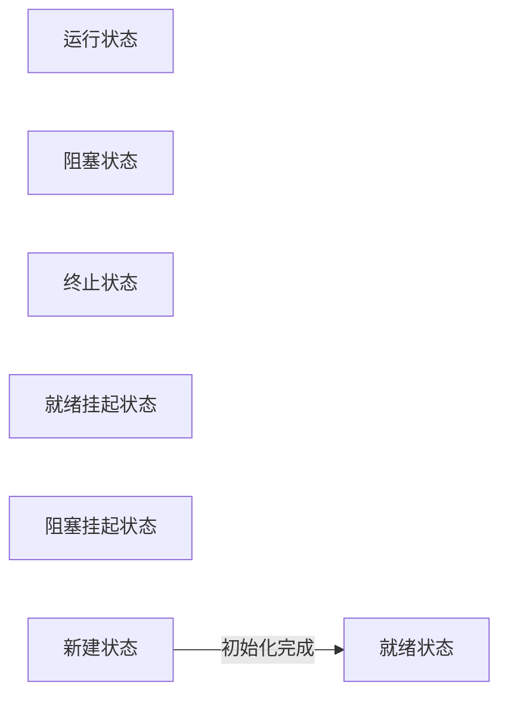
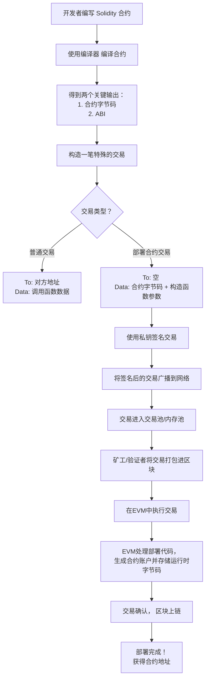

自己手绘图
TD
LR

```mermaid
graph LR;

C[运行状态]
D[阻塞状态]
E[终止状态]
F[就绪挂起状态]
G[阻塞挂起状态]

A[新建状态]--> |初始化完成| B[就绪状态]

```

这是一张图

```mermaid
graph TD;
    A[开发者编写 Solidity 合约] --> B[使用编译器 编译合约];
    B --> C[得到两个关键输出： <br>1. 合约字节码 <br>2. ABI];
    C --> D[构造一笔特殊的交易];
    D --> E{交易类型？};
    E -- 普通交易 --> F[To: 对方地址<br>Data: 调用函数数据];
    E -- 部署合约交易 --> G[To: 空 <br>Data: 合约字节码 + 构造函数参数];
    G --> H[使用私钥签名交易];
    H --> I[将签名后的交易广播到网络];
    I --> J[交易进入交易池/内存池];
    J --> K[矿工/验证者将交易打包进区块];
    K --> L[在EVM中执行交易];
    L --> M[EVM处理部署代码， <br>生成合约账户并存储运行时字节码];
    M --> N[交易确认， 区块上链];
    N --> O[部署完成！ <br>获得合约地址];
```